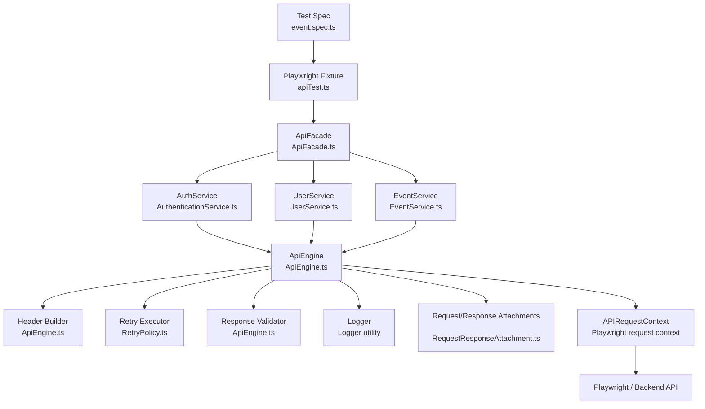

# API Layer Overview

This document explains the API execution flow first, and then describes the important files and folders under `src/api`, including what each one contains, why it is used, and the advantages it provides.

---

## 1. API execution flow: where the test picks what

The API flow in this framework starts from the test file and then moves through the framework layer by layer.

### Step 1: Playwright picks the test file

The test discovery is controlled by [playwright.config.ts](playwright.config.ts).

Important settings:

- `testDir: "./tests"` → Playwright looks inside the `tests` folder
- `testMatch: "**/*.spec.ts"` → it runs only `.spec.ts` files
- `use.baseURL` → application base URL is loaded from environment config

So the test file [tests/api/event.spec.ts](tests/api/event.spec.ts) is found from the Playwright config.

### Step 2: The test command comes from the package scripts

In [package.json](package.json), the API test run is driven by:

- `npm run api` → `playwright test tests/api`

This means the API tests are executed from the `tests/api` directory.

### Step 3: The spec uses the custom API fixture

The test file imports the shared fixture from [src/api/fixtures/apiTest.ts](src/api/fixtures/apiTest.ts).

That file extends Playwright's base `test` and injects the `api` fixture into the test context.

### Step 4: The API fixture factory creates the API object

The real object creation happens in [src/api/fixtures/apiFixture.ts](src/api/fixtures/apiFixture.ts).

That file creates:

- a Playwright `requestContext`
- a `TokenManager`
- an `ApiEngine`
- an `ApiFacade`

This means the test does not create an HTTP client manually inside the spec file.

### Step 5: The facade exposes service methods

The `api` object comes from [src/api/ApiFacade.ts](src/api/ApiFacade.ts).

It provides access to services such as:

- `api.service("auth")`
- `api.service("event")`
- `api.service("user")`

The service registry is created in [src/api/services/index.ts](src/api/services/index.ts).

### Step 6: Services call the engine

The service layer in [src/api/services](src/api/services) contains business-specific methods like:

- `login()`
- `createEvent()`
- `updateEvent()`
- `deleteEvent()`
- `getProfile()`

Each service method delegates actual request execution to [src/api/client/ApiEngine.ts](src/api/client/ApiEngine.ts).

### Step 7: The engine sends the HTTP request

The engine is the low-level request execution layer. It:

- builds headers
- builds the endpoint URL
- logs request details
- attaches request and response data for reporting
- sends the API request using Playwright request context
- parses the response body
- validates the result
- converts failures into typed exceptions

### Step 8: Scenario context carries values between requests

The context object in [src/api/context/ApiScenarioContext.ts](src/api/context/ApiScenarioContext.ts) stores values such as:

- token after login
- created event ID

This allows the same test to continue a workflow across multiple API calls.

### Architecture diagram

### What each file is used for

- `tests/api/event.spec.ts`  
  Test spec that defines the API workflow: login, create, update, delete.

- `src/api/fixtures/apiTest.ts`  
  Custom Playwright fixture that injects the `api` object into the test context.

- `src/api/fixtures/apiFixture.ts`  
  Creates the request context, token manager, engine, and facade for every API test.

- `src/api/ApiFacade.ts`  
  Main entry point that exposes services and scenario context to the test.

- `src/api/services/index.ts`  
  Registers the available services (`auth`, `user`, `event`) into a service map.

- `src/api/services/AuthenticationService.ts`  
  Handles login/logout and token-related behavior.

- `src/api/services/UserService.ts`  
  Wraps user profile and health-check API requests.

- `src/api/services/EventService.ts`  
  Wraps event create/update/delete operations.

- `src/api/client/ApiEngine.ts`  
  Actual HTTP execution engine. Builds URLs, headers, and performs the request.

- `src/api/client/RetryPolicy.ts`  
  Retry logic used when API calls need another attempt.

- `src/api/context/ApiScenarioContext.ts`  
  Stores temporary values such as token and event ID across steps in the same test.

- `src/api/auth/TokenManager.ts`  
  Stores and retrieves the auth token for secure requests.

- `src/api/requests/*.ts`  
  Defines the exact request payload shape for login and events.

- `src/api/responses/*.ts`  
  Defines the response structure expected from the backend so the test can assert on it properly.

- `src/api/types/*.ts`  
  Shared reusable request/response types used throughout the API layer.

- `src/api/exception/*.ts`  
  Custom exception classes for `400`, `401`, `404`, and `5xx` API failures.

- `src/api/index.ts`  
  Barrel export file that re-exports the API layer for easier importing.

---

## 2. API facade: `ApiFacade.ts`

### What it is

`ApiFacade` is the main wrapper object used by the tests.

### What it contains

It combines:

- all service instances
- the scenario context object

It exposes methods such as:

- `setContextValue()`
- `getContextValue()`
- `hasContextValue()`
- `removeContextValue()`
- `service()`

### Why we use it

The test should not directly manage all lower-level pieces. The facade gives a single, clean entry point for the API layer.

### Advantages

- hides implementation details
- gives one stable object for tests
- keeps service access simple and readable
- centralizes scenario-level data management

---

## 3. Barrel export: `index.ts`

### What it is

This file acts as the export center for the API module.

### What it exports

It re-exports the major API classes and types, such as:

- `ApiEngine`
- `RetryPolicy`
- `TokenManager`
- `ApiScenarioContext`
- service classes
- `ApiFacade`
- request/response types
- exception classes

### Why we use it

It simplifies imports across the framework.

### Advantages

- less messy import paths
- single public entry point for the API layer
- easy maintainability
- consistent access across the project

---

## 4. Client folder: actual HTTP execution

### `src/api/client/ApiEngine.ts`

### What it is

This is the request execution engine.

### What it does

It handles the actual HTTP communication with the API.

Responsibilities include:

- building headers
- building endpoint URLs
- attaching request/response details to reports
- performing `GET`, `POST`, `PUT`, `PATCH`, and `DELETE`
- parsing the response body
- validating response status
- converting failures into custom exceptions

### Why we use it

All API services eventually depend on this one engine; it avoids duplicate request code everywhere.

### Advantages

- one place for request execution logic
- consistent API behavior
- centralized response parsing
- standard error handling
- cleaner debugging and reporting

### `src/api/client/RetryPolicy.ts`

### What it is

This class implements retry behavior for requests.

### What it does

It retries operation execution based on configured retry count and delay.

### Why we use it

Some API requests can fail due to temporary issues. Retrying avoids flaky test failures.

### Advantages

- more stable automation
- fewer intermittent false failures
- reusable retry behavior
- keeps retry code out of each service

---

## 5. Context folder: scenario state storage

### `src/api/context/ApiScenarioContext.ts`

### What it is

This is the temporary in-memory data store for a test scenario.

### What it contains

It stores values using a map and provides methods like:

- `set()`
- `get()`
- `has()`
- `remove()`
- `clear()`

### Why we use it

API flows often depend on values generated earlier in the same test, such as token or created resource ID.

### Advantages

- supports step-by-step API workflows
- avoids repeated local variable handling
- keeps the flow organized
- improves test readability

---

## 6. Services folder: business-level API operations

### `src/api/services/BaseService.ts`

### What it is

The common shared base class for all service classes.

### Why we use it

It provides the shared `ApiEngine` dependency to all service classes.

### Advantages

- less duplicate code
- common structure for all services
- clean inheritance-based design

### `src/api/services/AuthenticationService.ts`

### What it is

This service handles login and authentication responsibilities.

### What it does

Methods include:

- `login()`
- `logout()`
- `getAccessToken()`
- `isLoggedIn()`

### Why we use it

Login is not just a raw request; it also updates the token manager with the returned auth token.

### Advantages

- clean separation of auth logic
- automatic token storage
- readable test calls
- easier future expansion of auth flows

### `src/api/services/EventService.ts`

### What it is

This service wraps event CRUD operations.

### What it does

It exposes methods like:

- `createEvent()`
- `updateEvent()`
- `deleteEvent()`

### Why we use it

The test should not know endpoint details and raw HTTP method usage repeatedly; the service encapsulates that.

### Advantages

- improves test readability
- centralizes endpoint usage
- consistent request structure
- easier maintenance when endpoints change

### `src/api/services/UserService.ts`

### What it is

This service handles user-related API calls.

### What it does

It contains methods such as:

- `getProfile()`
- `health()`

### Why we use it

This keeps user profile and health checks in a dedicated place.

### Advantages

- organized domain separation
- reusable user API methods
- easier future additions

### `src/api/services/index.ts`

### What it is

This file registers all the services into a map.

### What it does

It wires services together like:

- `auth`
- `user`
- `event`

### Why we use it

The facade can then access services through a single map rather than manual construction everywhere.

### Advantages

- cleaner service registration
- consistent service retrieval
- easy centralized extension

---

## 7. Fixture folder: API setup injection

### `src/api/fixtures/apiFixture.ts`

### What it is

This file creates the API test fixture object.

### What it does

It creates:

- a request context
- token manager
- engine
- facade

### Why we use it

This is the setup layer for API tests. It prevents duplicate initialization code in every spec file.

### Advantages

- consistent setup
- reusable fixture
- better maintainability
- one place to tune API context behavior

### `src/api/fixtures/apiTest.ts`

### What it is

This file extends Playwright's base `test` with the `api` fixture.

### What it does

It injects the `api` object into the test context and disposes of the request context after use.

### Why we use it

This gives every API test a ready-to-use API wrapper without writing custom setup each time.

### Advantages

- less boilerplate in tests
- reusable API fixture support
- clean lifecycle management

---

## 8. Auth folder: token management

### `src/api/auth/TokenManager.ts`

### What it is

This class handles the access token used by protected APIs.

### What it provides

- `setToken()`
- `getToken()`
- `hasToken()`
- `clear()`

### Why we use it

Most API flows require authentication headers for secured endpoints.

### Advantages

- central token storage
- avoids manual token passing in every call
- easy to clear or refresh
- keeps authorization logic isolated

---

## 9. Requests folder: request model definitions

### `src/api/requests/LoginRequest.ts`

### What it is

Defines the login payload contract.

### Why we use it

It ensures the request body has correct fields such as `email` and `password`.

### Advantages

- typed payload structure
- fewer payload mistakes
- clearer API intent

### `src/api/requests/EventRequest.ts`

### What it is

Defines the request body used for event create/update methods.

### Why we use it

Event-related operations require a consistent body structure.

### Advantages

- shared request schema
- avoids duplication
- easier maintenance

---

## 10. Responses folder: response model definitions

### `src/api/responses/LoginResponse.ts`

### What it is

Defines the login response structure.

### Why we use it

The test can assert on well-defined fields from the server response.

### Advantages

- typed response access
- cleaner assertions
- stronger confidence in API contract

### `src/api/responses/EventResponse.ts`

### What it is

Defines the event response structure.

### Why we use it

The CRUD flow needs to read many response fields, so a strong response model helps the test stay precise.

### Advantages

- predictable schema
- easier validations
- better readability

### `src/api/responses/UserProfileResponse.ts`

### What it is

Defines the profile response structure.

### Why we use it

It gives the profile API a reusable typed contract.

### Advantages

- reduces runtime property errors
- keeps response expectations explicit

---

## 11. Types folder: reusable API contracts

### `src/api/types/ApiRequest.ts`

Defines the standard request signature passed into the engine.

### `src/api/types/ApiResponse.ts`

Defines the standard response object returned from the engine.

### `src/api/types/ApiHeaders.ts`

Defines request headers as a string map.

### `src/api/types/ApiQueryParams.ts`

Defines query parameter typing.

### `src/api/types/HttpMethod.ts`

Defines the allowed HTTP verbs.

### Why these types are used

They allow the API layer to speak in one consistent shape.

### Advantages

- better typing
- central reusable contracts
- fewer mistakes in request building
- easier extensibility

---

## 12. Exception folder: structured failure handling

### What it contains

This folder defines custom exceptions for API error cases.

- `ApiException.ts` → base exception
- `AuthenticationException.ts` → unauthorized errors
- `ValidationException.ts` → bad request errors
- `ResourceNotFoundException.ts` → missing resource errors
- `ServerException.ts` → server-side failures

### Why we use it

The framework needs more detail than a generic failure. Different HTTP status codes should be classified clearly.

### Advantages

- clearer failure diagnosis
- better debugging experience
- better reporting and maintenance
- more intentional error handling

---

## 13. Final flow summary

The overall API lifecycle is:

1. [package.json](package.json) invokes Playwright API test execution
2. [playwright.config.ts](playwright.config.ts) discovers the spec file
3. [tests/api/event.spec.ts](tests/api/event.spec.ts) uses the API fixture
4. [src/api/fixtures/apiTest.ts](src/api/fixtures/apiTest.ts) provides the `api` fixture
5. [src/api/fixtures/apiFixture.ts](src/api/fixtures/apiFixture.ts) creates the request context and engine
6. [src/api/ApiFacade.ts](src/api/ApiFacade.ts) gives access to services and context
7. [src/api/services/index.ts](src/api/services/index.ts) registers service classes
8. [src/api/services](src/api/services) exposes domain methods
9. [src/api/client/ApiEngine.ts](src/api/client/ApiEngine.ts) performs the actual HTTP call
10. [src/api/context/ApiScenarioContext.ts](src/api/context/ApiScenarioContext.ts) carries values such as token and event id between steps

This is the main architecture behind the API layer in this framework.
