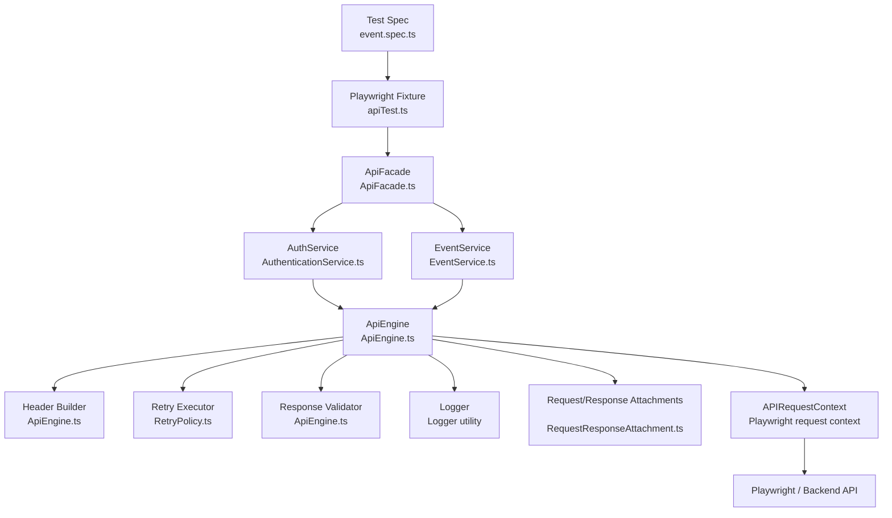

### Architecture diagram

### What each file is used for

- `tests/api/event.spec.ts`  
  Test spec that defines the API workflow: login, create, update, delete.

- `src/api/fixtures/apiTest.ts`  
  Custom Playwright fixture that injects the `api` object into the test context.

- `src/api/fixtures/apiFixture.ts`  
  Creates the request context, token manager, engine, and facade for every API test.

- `src/api/ApiFacade.ts`  
  Main entry point that exposes services and scenario context to the test.

- `src/api/services/index.ts`  
  Registers the available services (`auth`, `event`) into a service map.

- `src/api/services/AuthenticationService.ts`  
  Handles login/logout and token-related behavior.

- `src/api/services/EventService.ts`  
  Wraps event create/update/delete operations.

- `src/api/client/ApiEngine.ts`  
  Actual HTTP execution engine. Builds URLs, headers, and performs the request.

- `src/api/client/RetryPolicy.ts`  
  Retry logic used when API calls need another attempt.

- `src/api/context/ApiScenarioContext.ts`  
  Stores temporary values such as token and event ID across steps in the same test.

- `src/api/auth/TokenManager.ts`  
  Stores and retrieves the auth token for secure requests.

- `src/api/requests/*.ts`  
  Defines the exact request payload shape for login and events.

- `src/api/responses/*.ts`  
  Defines the response structure expected from the backend so the test can assert on it properly.

- `src/api/types/*.ts`  
  Shared reusable request/response types used throughout the API layer.

- `src/api/exception/*.ts`  
  Custom exception classes for `400`, `401`, `404`, and `5xx` API failures.

- `src/api/index.ts`  
  Barrel export file that re-exports the API layer for easier importing.

---
